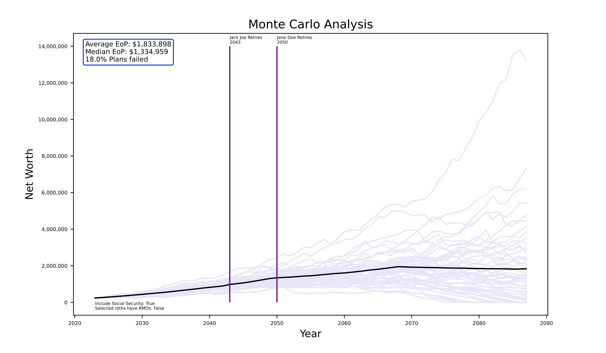

## Retirement Projection


This tool was built to be able to run comparisons of a few different scenarios for retirement. First and foremost it was built to understand the impact on a plan of using a Roth 401K vs a Traditional 401K. Most financial projections make this comparison difficult at best. The tool was then expanded to understand impact of not including social security and the impact of a great recession type event the year of retirement.

This has been built to be very configurable (probably too configurable) on expenses and timing of those expenses and will generate a graph and table of the expenses over the course of the plan.


This runs a Monte Carlos simulation of 4 the selected scenarios:
- Selected Roth HAVE RMDs
- Without Social Security
- Bad timing

This simulation does NOT adjust or account for inflation, so all numbers are in the dollar amount for the simulation start year (set to 2024 in `PyFinancialPlanner.py`). For each of the 1000 iterations, a random number is generated based on the S&P 500 average rate of return and standard deviation with a normal distribution for each year of the financial plan duration as the growth for that year.

Some notes: 
- When it comes time to withdraw funds to cover expenses (i.e. income from sources such as RMD, income, social security) the program will pull funds from the first account it finds in `accounts.json` until it reaches 0 and then move to the next account. Once an account is at 0 it is effectively "closed". A plan fails when all accounts are 0.
- If it happens that income (social security or income) and RMDs exceed expenses and taxes, the excess funds will get added to the first account in the list of accounts. In the future this should be adjusted to the first "investment" account. 

## Requirements
The following libraries are necessary and can be installed with `pip`:
- json
- numpy
- pandas
- matplotlib
- asyncio
- yfinance

## Configuration
There are several files needed for configuration of this tool:
- `accounts.json`
- `expenses.json`
- `owners.json`

This program also has two files included as "adjustable" in the event that the government changes something tax wise:
- `rmd.json`
- `tax.json`

### `accounts.json`
```
{
    "accounts": [
        {
            "Name": "Account Name A", 
            "Balance": 123456.78,
            "Annual Additions": 0.0, 
            "Type": "Investment",
            "Owner Name": "Owner 1",
            "Test as Tax Deferred": false
        },
        {
            "Name": "Account Name B",
            "Balance": 876543.21,
            "Annual Additions": 0.0,
            "Type": "401K",
            "Owner Name": "Owner 2",
            "Test as Tax Deferred": false,
            "allocation": 
                [{"year": 2023, "stocks": 100, "bonds": 0},
                 {"year": 2045, "stocks": 25, "bonds": 75}]
        }
    ]
}
```
- `"Name"`: This is just a label, name it whatever you want. Nothing was tested with two accounts having the same name...
- `"Balance"`: Self describing
- `"Annual Additions"`: If the account has funds added (like 401K while working), add that here
- `"Type"`: Options:
  - `"401K"` or `"IRA"`: Has RMDs, distributions taxed
  - `"Roth"`: Does not have RMD (unless trialed with), not taxed
  - `"Investment"`: Growth taxed annually
  - `"HSA"`: Not taxed, no RMD
- `"Owner Name"`: Must be in the list of `owners.json`
- `"trial_with_rmd"`: If the account type is `"Roth"` the program will run a simulation in which this account will have RMDs
- `"allocation"`: This is optional. If allocation between stocks and bonds is desired for an account (and how that changes over time) it can be entered here. Assumption is 100% stock allocation if not provided.

### `expenses.json`
```
{
    "expenses": [
        {
            "Description": "Living",
            "Cost": 60000,
            "Year Starts": 2023,
            "Year Ends": 2042,
            "Every x Year(s)": 1
        },
        {
            "Description": "Living Jack Joe Retired",
            "Cost": 50000,
            "Year Starts": 2043,
            "Year Ends": 2049,
            "Every x Year(s)": 1
        }
    ]
}
```
- `"Description"`: Just a label
- `"Cost"`: How much is the expense annually?
- `"Year Starts"`: Year the expense starts
- `"Year Ends"`: Year the expense ends [optional] - if not included expense will run to end of plan
- `"Every x Year(s)"`: How many years between expenses? For example, 5 means the expense happens every 5th year (2043, 2048, 2053, etc.)
### `owners.json`
```
{
    "owners": [
        {
            "Name": "Jane Doe",
            "Year of Birth": 1980,
            "Life Expectancy": 99,
            "Retirement Age": 70,
            "Pre-retirement Take Home Pay": 90000,
            "Social Security": 20000,
            "Age Starts Social Security": 70
        },
        {
            "Name": "Jack Joe",
            "Year of Birth": 1975,
            "Life Expectancy": 99,
            "Retirement Age": 68,
            "Pre-retirement Take Home Pay": 50000,
            "Social Security": 15000,
            "Age Starts Social Security": 70
        }
    ]
}
```
- `"Name"`: Just a label
- `"Year of Birth"`: What year was this person born?
- `"Life Expectancy"`: How many years will this person live?
- `"Retirement Age"`: What year will this person retire?
- `"Pre-retirement Take Home Pay"`: What is the income while working?
- `"Social Security"`: What social security is expected?
- `"Age Starts Social Security"`: What year will this person start to pull social security?

## Usage
This has been developed with unit tests for some aspects. From the root directory run `pytest` and the unit tests will run:

To run the plan simply execute:
```
python3 PyFinancialPlanner.py
```
It is possible to put a copy of `accounts.json`, `expenses.json`, and `owners.json` in a different folder and specify that when running:
```
python3 PyFinancialPlanner.py path_to_your_data
```
The results will be stored in a pdf file named financial_analysis.pdf

It is possible to see expanded details of the failed trials. This significantly adds to the time to run the program as pyplot does not appear to be terribly fast. In `plot_monte_carlos.py` change the following to `True` as appropriate:
```
include_failed_plans = False
include_tables = False
```

## To Do List
- [ ] ...
